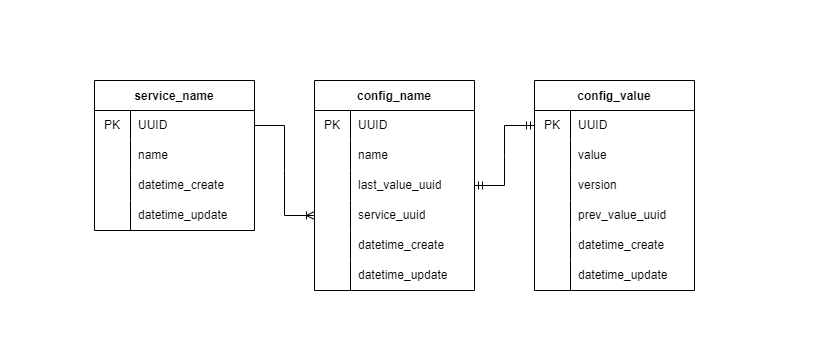

# Distributed config

## Описание

API, позволяющее сохранять конфигурацию в postgres, отслеживать версионирование параметров конфигурации,
запрашивать требуюмую конфигурацю для ранее внесённого в базу сервиса

## Выполненные технические требования
- [x] язык программирования Python
- [x] формат схемы конфига json
- [x] сервис должен обеспечивает персистентность данных
- [x] сервис поддерживает все CRUD операции по работе с конфигом
- [x] поддерживается версионирование конфига при его изменении
- [ ] удалять конфиг допускается только если он не используется никаким приложением

## Здорово, что:
- [ ] в качестве протокола взаимодействия сервиса с клиентами использовал gRPC
- [x] написал Dockerfile и docker-compose.yml
- [x] покрыл проект unit-тестами
- [ ] сделал тестовый пример использования написанного сервиса конфигураций

## Техническая реализация

<div style="display:flex; justify-content:center">
  <div>
    
    <p align="center">Схема postgres</p>
  </div>
</div>  

## Пример использования сервиса

### Запуск

Перед запуском убедитесь, что в системе установлен `docker` и `docker-compose` коомандами:

```bash
sudo docker --version
sudo docker-compose --version
```

Да лее проверьте, запущен ли демон `docker`
```bash
sudo docker ps
```

Тогда можно поднимать сервис

```bash
git clone https://github.com/gdagil/distributed-config.git
cd distributed-config
sudo bash ./start.sh
```

### Тестирование

После запуска всех контейнеров можно выполнить тестирование (полностью покрывает все запросы, описанные ниже)

```bash
python -m venv venv 
```

Для Linux

```bash
source venv/bin/activate
```

Для Windows

```bash
source venv/Scripts/activate
```

Далее устанавливаем пакеты и производим тестирование

```bash
pip install -r tests/requirements.txt
pytest
```


### Создание конфига

#### **Запрос**

`curl -d "@data.json" -H "Content-Type: application/json" -X POST http://localhost:8080/config`

```json
{
    "service": "managed-k8s",
    "data": [
        {"key1": "value1"},
        {"key2": "value2"}
    ]
}
```

#### **Ответ**

`status_code: 201`

```json
{
  "success": true,
  "detail": "Successfully created"
}
```

### Получение конфига

`curl http://localhost:8080/config?service=managed-k8s`

```json
{
    "key1": "value1", 
    "key2": "value2"
}
```

### Изменение конфига

#### **Запрос**
`curl -d "@data.json" -H "Content-Type: application/json" -X PUT http://localhost:8080/config`

```json
{
    "service": "managed-k8s",
    "data": [
        {
            "key1": "learn"
        },
        {
            "key2": "golang"
        }
    ]
}
```

#### **Ответ**

`status_code: 200`

```json
{
  "success": true,
  "detail": "Successfully created"
}
```

### Просмотр версий конфигурации

#### **Запрос**

`curl http://localhost:8080/version/history?service=managed-k8s`

#### **Ответ**

`status_code: 200`

```json
{
  "key2": {
    "value": "golang",
    "version": 2,
    "prev_version": {
      "value": "value2",
      "version": 1,
      "prev_version": null
    }
  },
  "key1": {
    "value": "learn",
    "version": 2,
    "prev_version": {
      "value": "value1",
      "version": 1,
      "prev_version": null
    }
  }
}
```

*При изменении только одного параметра в конфигурации*

```json
{
  "key2": {
    "value": "golang",
    "version": 2,
    "prev_version": {
      "value": "value2",
      "version": 1,
      "prev_version": null
    }
  },
  "key1": {
    "value": "now",
    "version": 3,
    "prev_version": {
      "value": "learn",
      "version": 2,
      "prev_version": {
        "value": "value1",
        "version": 1,
        "prev_version": null
      }
    }
  }
}
```

### Получение конкретной версии конфигурации

#### **Запрос**

`curl http://localhost:8080/version?service=managed-k8s&version=2`

#### **Ответ**

`status_code: 200`

```json
{
  "key2": "golang",
  "key1": "learn"
}
```